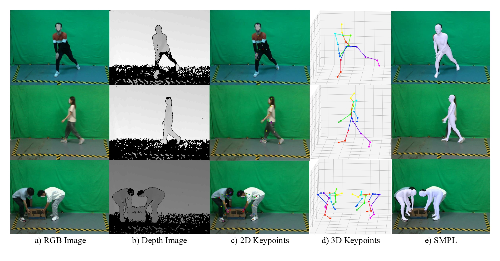

# HuMoMM: A Multi-Modal Dataset and Benchmark for Human Motion Analysis

This is the official repository of paper:

>HuMoMM: A Multi-Modal Dataset and Benchmark for Human Motion Analysis  
>Xiong Zhang, Minghui Wang, Ming Zeng, Wenxiong Kang*, and Feiqi Deng

## Abstract
Human motion analysis is a fundamental task in computer vision, and there is an increasing demand for versatile datasets with the development of deep learning. However, how to obtain the annotations of human motion, such as 3D keypoints and SMPL parameters, requires further research. In this work, we design a multi-view human motion capture system and develop a toolchain to generate multi-modal motion annotations. Additionally, we contribute HuMoMM, a large-scale multi-modal dataset which has the following characteristics: 1) multiple modalities, including two data formats, i.e., RGB and depth images, and four annotation formats, i.e., action categories, 2D keypoints, 3D keypoints, and SMPL parameters; 2) large-scale with 18 subjects, 30 actions, 3.5k sequences, and 262k frames; 3) multi-task for action recognition, 2D keypoint detection, 3D pose estimation and human mesh recovery. Furthermore, we provide a benchmark on HuMoMM to test the performance of popular methods in several related tasks. The experimental results demonstrate that HuMoMM holds significant research value. We expect HuMoMM can contribute to human motion-related research, and it will be publicly accessible after the paper is accepted.

## Dataset
The HuMoMM Dataset is publicly available(free of charge) to the research community. Unfortunately, due to privacy reasons, we cannot provide the database for commercial use. If you are interested in obtaining the HuMoMM dataset, you should download [release agreement](./assets/HuMoMM%20Release%20Agreement.docx), and send by e-mail one signed and scanned copy to scutbip@outlook.com.

While reporting results using the HuMoMM Dataset, please cite the following article:

@inproceedings{Zhang2023HuMoMM,
  title={HuMoMM: A Multi-Modal Dataset and Benchmark for Human Motion Analysis},
  author={Zhang, Xiong and Wang, Minghui and Zeng, Ming and Kang, Wenxiong and Deng, Feiqi},
  booktitle={Image and Graphics: 11th International Conference, ICIG 2023, Nangjing, China},
  pages={},
  year={2023},
  organization={Springer}
}

## Toolchain
We develop a toolchain for generating multi-modal motion annotations, the toolchain is released in [toolchain](./toolchain). For more details of the toolchain, please refer to [toolchain.md](./toolchain/README.md).

## Benchmark
We provide a benchmark for various domains, including action recognition, 2D keypoint detection, 3D pose estimation, and human mesh recovery. The benchmark code can be found in [benchmark](./benchmark/), for more detail of out benchmark, please refer to [benchmark.md](./benchmark/README.md).

## Contact

Prof. Kang Wenxiong

Biometrics and Intelligence Perception Lab.

College of Automation Science and Engineering

South China University of Technology

Wushan RD.,Tianhe District,Guangzhou,P.R.China,510641

auwxkang@scut.edu.cn