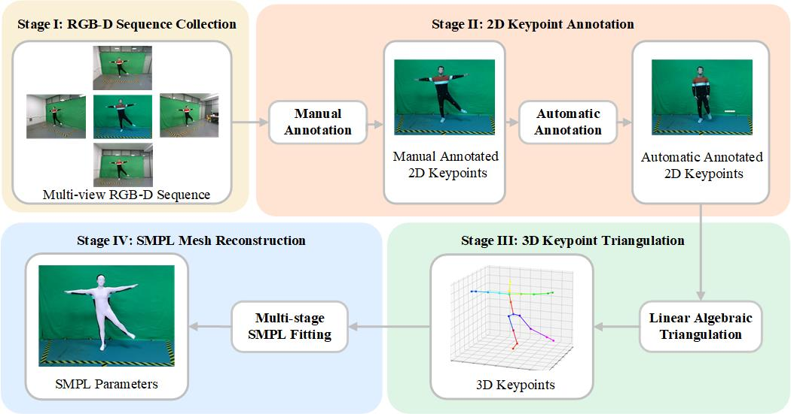

# Toolchain

We develop a comprehensive toolchain to complete the entire annotation generation
process. A diagram of the pipeline is shown as below:

## 2D Keypoint Annotations

For the annotation of 2D keypoints, we design our keypoint definition and divide
the annotation procedure into two stages: manual annotation and automatic
annotation. We use labelme for manual annotation and the code of automatic annotation can be found in [automatic annotation](./2d_keypoint_annotation/).

## 3D Keypoint Triangulation
We apply linear algebraic triangulation to obtain the coordinates of the 3D keypoints. The code can be found in [3D Keypoint Triangulation](./3d_keypoint_triangulation/).

## SMPL Mesh Reconstruction
We use Easymocap to generate the SMPL parameters, the code can be found in [smpl reconstruction](./smpl_reconstruction/).

